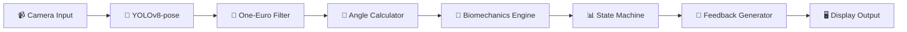
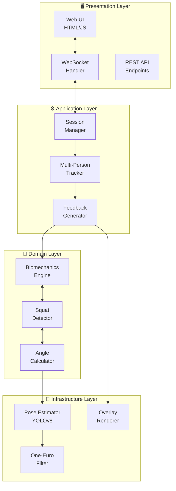
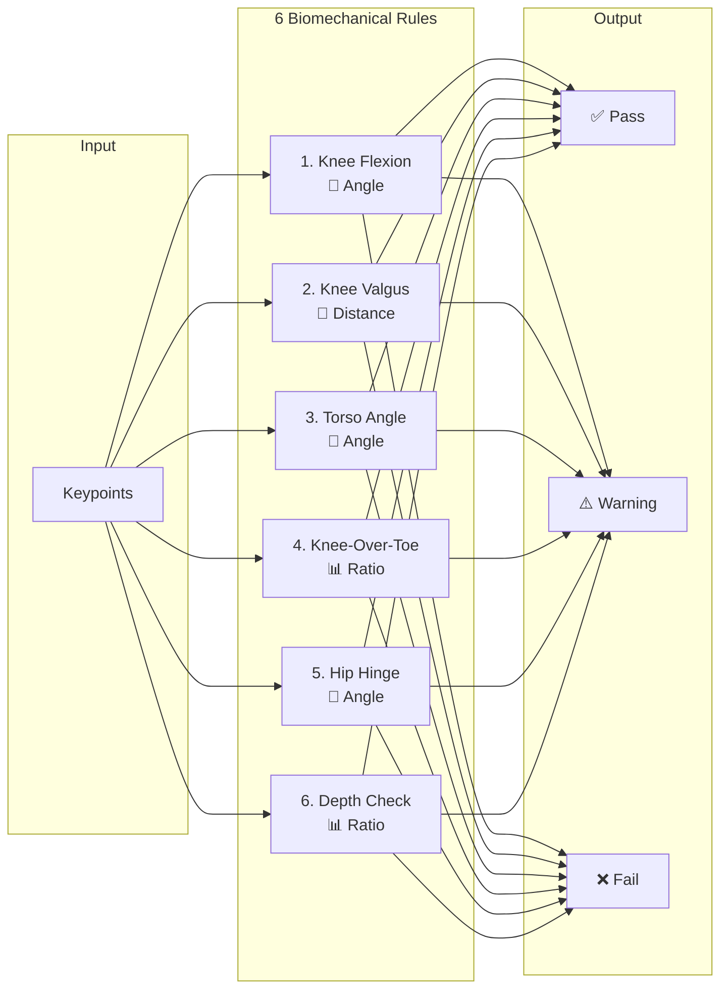
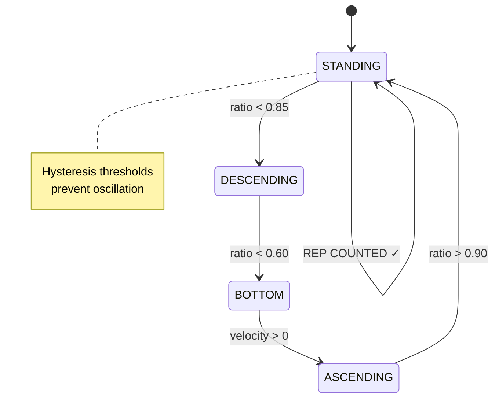

<p align="center">
  
</p>

<h1 align="center">Squat Analyzer</h1>

<p align="center">
  <strong>🎯 AI-powered real-time squat form analysis using computer vision and biomechanics</strong>
</p>

<p align="center">
  <a href="#-quick-start">Quick Start</a> •
  <a href="#-features">Features</a> •
  <a href="#-architecture">Architecture</a> •
  <a href="#-pipeline">Pipeline</a> •
  <a href="#-api-reference">API</a> •
  <a href="#-benchmarks">Benchmarks</a>
</p>

<p align="center">
  
  
  
  
  
</p>

<p align="center">
  
  
  
</p>

---

## 💡 Why Squat Analyzer?

<table>
<tr>
<td width="33%" align="center">
<h3>😰 The Problem</h3>
<p>Poor squat form causes <strong>80% of gym injuries</strong>. Personal trainers cost $150+/session. Mirrors don't give feedback.</p>
</td>
<td width="33%" align="center">
<h3>🎯 The Solution</h3>
<p>AI that watches your form like a <strong>sports scientist</strong> — real-time, research-backed, actionable feedback.</p>
</td>
<td width="33%" align="center">
<h3>✨ The Result</h3>
<p><strong>6 biomechanical rules</strong> evaluated at 25+ FPS with sub-100ms latency. No expensive equipment needed.</p>
</td>
</tr>
</table>

### Real Feedback Examples

```diff
+ ✅ "Excellent depth! Knee angle 95° is optimal"
+ ✅ "Good torso position — spine neutral"
+ ✅ "Knees tracking well over toes"

- ⚠️ "Squat depth insufficient — hips too high"
-    → Correction: "Sit back and down. Imagine sitting into a low chair"

- ❌ "KNEE VALGUS — Injury risk! Knees collapsing inward"  
-    → Correction: "Push knees OUT over pinky toes"
```

---

## 🚀 Quick Start

### Installation

```bash
# Clone repository
git clone https://github.com/Abhishekgupta1223/squat-analyzer.git
cd squat-analyzer

# Create virtual environment (recommended)
python -m venv .venv
.venv\Scripts\activate      # Windows
# source .venv/bin/activate  # Linux/Mac

# Install package
pip install -e .
```

### Run Web Application

```bash
python run_webapp.py
```

Open **http://localhost:8000** in your browser.

| Method | Command | Description |
|--------|---------|-------------|
| 🌐 **Web App** | `python run_webapp.py` | Browser-based UI with webcam/video upload |
| 📹 **Webcam** | `squat-analyzer` | Direct webcam analysis |
| 🎬 **Video** | `squat-analyzer --source video.mp4` | Analyze video file |

---

## ✨ Features

| Feature | Description |
|---------|-------------|
| 🎯 **Multi-person tracking** | Analyze multiple people simultaneously with independent rep counting |
| 📐 **6 biomechanical rules** | Research-backed evaluation from sports science literature |
| ⚡ **Real-time feedback** | Sub-100ms latency with adaptive frame throttling |
| 🔧 **Signal processing** | One-Euro filter eliminates keypoint jitter |
| 📊 **Phase detection** | State machine tracks Standing → Descent → Bottom → Ascent |
| 🌐 **Web interface** | No installation for end users — just open browser |

---

## 🔄 Pipeline

### Data Flow



### Processing Steps

| Step | Component | Input | Output |
|:----:|-----------|-------|--------|
| 1️⃣ | **Frame Capture** | Raw video | Resized 640px frame |
| 2️⃣ | **Pose Detection** | Frame | 17 COCO keypoints |
| 3️⃣ | **Signal Filter** | Raw keypoints | Smoothed keypoints |
| 4️⃣ | **Angle Calculation** | Keypoints | Joint angles |
| 5️⃣ | **Rule Evaluation** | Angles | Pass/Warn/Fail |
| 6️⃣ | **Phase Detection** | Angles | Squat phase |
| 7️⃣ | **Feedback** | Results | Prioritized messages |

---

## 🏗️ Architecture

### System Overview



### Directory Structure

```
squat-analyzer/
├── 📁 src/squat_analyzer/
│   ├── 📁 core/                    # Foundation
│   │   ├── pose_estimator.py       # YOLOv8 wrapper
│   │   ├── keypoints.py            # COCO keypoint mapping
│   │   └── angles.py               # Vector mathematics
│   │
│   ├── 📁 analysis/                # Intelligence
│   │   ├── biomechanics.py         # 6 rule classes
│   │   ├── squat_detector.py       # FSM + rep counting
│   │   ├── feedback.py             # Message generation
│   │   └── multi_person_tracker.py # Zone-locking tracker
│   │
│   ├── 📁 filtering/               # Signal processing
│   │   └── one_euro.py             # Adaptive noise filter
│   │
│   └── 📁 visualization/           # Output
│       └── renderer.py             # Skeleton overlay
│
├── 📁 webapp/                      # Web interface
│   ├── server.py                   # FastAPI server
│   └── 📁 static/index.html        # SPA
│
├── 📁 demo_videos/                 # 9 test videos
├── 📁 presentation/                # HTML slides
└── 📁 tests/                       # Pytest suite
```

---

## 📐 Biomechanical Rules

### The 6 Research-Backed Rules

| # | Rule | Method | Threshold | Reference |
|:-:|------|--------|:---------:|-----------|
| 1 | **Knee Flexion** | Hip-knee-ankle angle | 70°-135° | Schoenfeld 2010 |
| 2 | **Knee Valgus** | Lateral deviation from hip-ankle line | <10° | Hewett 2005 |
| 3 | **Torso Inclination** | Shoulder-hip vector vs vertical | 30°-75° | Escamilla 2001 |
| 4 | **Knee-Over-Toe** | Horizontal knee extension ratio | <15% | Fry 2003 |
| 5 | **Hip Hinge** | Torso-thigh angle | 45°-100° | Hartmann 2013 |
| 6 | **Depth Check** | Hip-to-ankle vertical ratio | >0.5 | NSCA |

### Rule Computation



---

## 📊 State Machine

### Squat Phase Detection



**Hysteresis**: Different thresholds for enter (0.85) vs exit (0.90) prevents false transitions at boundaries.

---

## 📈 Benchmarks

### Performance by Configuration

| Configuration | FPS | Latency | Memory |
|:--------------|:---:|:-------:|:------:|
| 🖥️ CPU (i7-10750H) | 22 | 45ms | 480MB |
| 🎮 GPU (RTX 3060) | 68 | 15ms | 1.2GB |
| 🌐 WebSocket | 18 | 68ms | 520MB |
| 📱 Raspberry Pi 4 | 8 | 125ms | 400MB |

### Optimizations Applied

- ✅ Frame resize to 640px → **4x speedup**
- ✅ Adaptive frame throttling → **Stable latency**
- ✅ One-Euro filter (not Kalman) → **Lower compute**
- ✅ YOLOv8n nano model → **2.4M params only**
- ✅ Confidence threshold 0.5 → **Skip low-quality**
- ✅ Zone-locking tracker → **O(1) tracking**

---

## 🔌 API Reference

### Python API

```python
from squat_analyzer.core import PoseEstimator
from squat_analyzer.analysis import BiomechanicsEngine, SquatDetector

# Initialize
pose = PoseEstimator(model="yolov8n-pose.pt", confidence=0.5)
engine = BiomechanicsEngine()  # Loads 6 rules
detector = SquatDetector()     # State machine

# Process frame
keypoints = pose.estimate(frame)           # → 17 keypoints
angles = engine.compute_angles(keypoints)  # → dict of angles
results = engine.evaluate(keypoints, angles)  # → list of RuleResult
phase = detector.update(angles)            # → SquatPhase enum
reps = detector.rep_count                  # → int

# Get feedback
for result in results:
    print(f"[{result.status}] {result.message}")
    if result.correction:
        print(f"  → {result.correction}")
```

### WebSocket API

```javascript
const ws = new WebSocket('ws://localhost:8000/ws/analyze/{session_id}');

// Send frame
ws.send(JSON.stringify({ frame: base64ImageData }));

// Receive analysis
ws.onmessage = (event) => {
    const data = JSON.parse(event.data);
    // data.feedback  → [{text, priority, type}, ...]
    // data.reps      → {person_1: 5, person_2: 3}
    // data.phase     → "DESCENDING"
    // data.latency   → 45
};
```

### REST Endpoints

| Method | Endpoint | Description |
|--------|----------|-------------|
| `GET` | `/` | Web UI |
| `POST` | `/api/session/start` | Create session |
| `POST` | `/api/session/{id}/end` | End session |
| `GET` | `/api/demo-videos` | List test videos |
| `WS` | `/ws/analyze/{id}` | Real-time stream |

---

## ⚙️ Configuration

Edit `config/settings.yaml`:

```yaml
pose_estimation:
  model: yolov8n-pose.pt
  confidence_threshold: 0.5
  max_detections: 10

biomechanics:
  knee_flexion:
    optimal_range: [70, 135]
  knee_valgus:
    warning_threshold: 5
    fail_threshold: 10
  
filtering:
  one_euro:
    min_cutoff: 1.0
    beta: 0.007
```

---

## ⚠️ Assumptions & Limitations

<details>
<summary><strong>📋 Click to expand</strong></summary>

### ✅ Assumptions

| Category | Assumption |
|----------|------------|
| **Camera** | Static, frontal/side view, 2-4m distance |
| **Lighting** | Adequate (~100+ lux) |
| **Clothing** | Fitted, contrasting with background |
| **Movement** | Controlled tempo (>250ms/phase) |

### ❌ Limitations

| Limitation | Future Mitigation |
|------------|-------------------|
| 2D only (no rotation) | Stereo cameras |
| Squats only | Extensible architecture |
| No load detection | Object detection |
| Fixed thresholds | Calibration routine |

</details>

---

## 📚 References

1. **Schoenfeld, B.J.** (2010). *Squatting Kinematics and Kinetics*. JSCR.
2. **Hewett, T.E. et al.** (2005). *Biomechanical Measures of Neuromuscular Control*. AJSM.
3. **Escamilla, R.F.** (2001). *Knee Biomechanics of the Dynamic Squat*. MSSE.
4. **Casiez, G. et al.** (2012). *1€ Filter*. ACM CHI.
5. **Fry, A.C. et al.** (2003). *Effect of Knee Position on Torques*. JSCR.

---

## 🤝 Contributing

Contributions welcome! See [CONTRIBUTING.md](CONTRIBUTING.md).

```bash
pip install -e ".[dev]"
pytest                    # Run tests
ruff check src/ tests/    # Lint
```

---

## 📄 License

MIT License — see [LICENSE](LICENSE).

---

<p align="center">
  <sub>Built with ❤️ using YOLOv8, FastAPI, and sports science research</sub>
</p>

<p align="center">
  <a href="https://github.com/Abhishekgupta1223/squat-analyzer">⭐ Star</a> •
  <a href="https://github.com/Abhishekgupta1223/squat-analyzer/issues">🐛 Bug</a> •
  <a href="https://github.com/Abhishekgupta1223/squat-analyzer/issues">✨ Feature</a>
</p>
